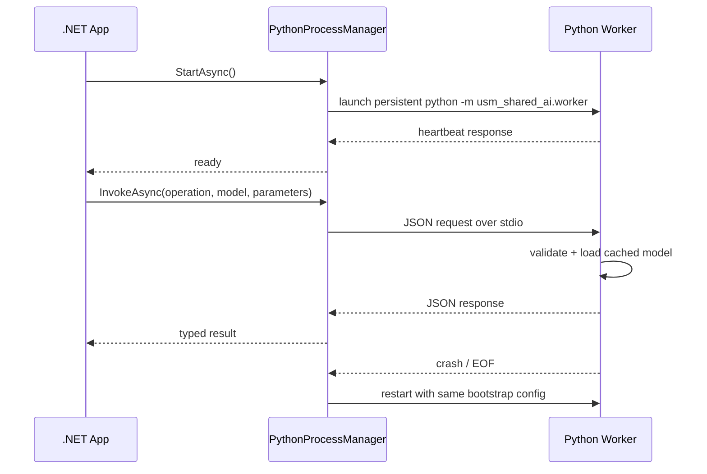

# Python AI runtime

## Sequence diagram



## Folder structure

```text
Shared/AI/
  Abstractions/
  Core/
  Python/
    PythonAIContracts.cs
    PythonAIInfrastructure.cs
    PythonHosting.cs
    PythonProcessManager.cs
  Extensions/
    PythonAIServiceCollectionExtensions.cs
  deployment/
    Dockerfile
    docker-compose.yml
  docs/
    python-runtime.md
  samples/
    appsettings.json
  python_worker/
    pyproject.toml
    usm_shared_ai/
      worker/
        app.py
        config.py
        handlers.py
        protocol.py
        state.py
        __main__.py
```

## Notes

- Requests and responses are JSON-only.
- Worker processes stay alive and cache models for the process lifetime.
- Adding a new AI library only requires a new Python handler registration.

