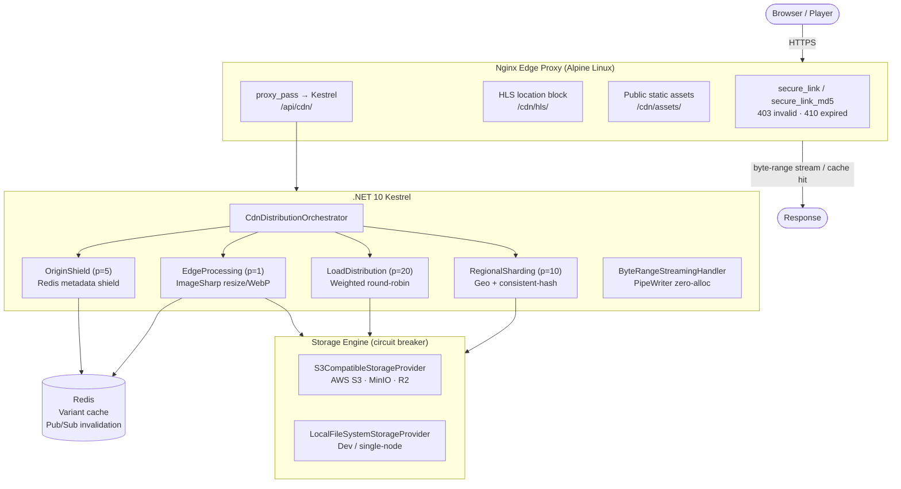

# Development Wiki

This page is the technical handbook for contributors working in `Usm.Inventory.MonoRepo`. It is intended to support day-to-day development and long-term maintenance.

## 1. Repository overview

The repository is a monorepo for a military inventory platform, built around domain-aligned backend services plus a single Angular frontend.

### Primary top-level directories

| Path | Purpose |
| --- | --- |
| `Services/` | Domain services (Identity, Iam, Administration, StoreHouse, IssueReceipt, Procurement, Reporting, etc.) |
| `Shared/` | Reusable cross-service components (contracts, validation, messaging, caching, CDN delivery, utilities) |
| `Shared/CDN/` | `Usm.Shared.Infrastructure.CDN` – CDN-like static media delivery: byte-range streaming, image processing, Nginx MD5 secure links, multi-provider storage, Redis-backed cache invalidation |
| `Gateway/ApiGateway` | Reverse proxy/API entrypoint (YARP) |
| `Frontend/Angular` | Angular SPA |
| `AppHost/` | Local orchestration host for development |
| `ServiceDefaults/` | Shared service bootstrapping defaults (telemetry, health checks, host conventions) |
| `Platform/` | Infrastructure/operations assets (Kubernetes manifests, observability config) |
| `scripts/` | Helper scripts (for example, certificate-related setup) |

## 2. Architecture and conventions

Backend services follow Clean Architecture and CQRS patterns:

- `*.Api`: HTTP boundary, configuration, middleware, DI composition.
- `*.Application`: use-cases, MediatR handlers, validators, orchestration.
- `*.Domain`: domain model, business rules, aggregates/value objects.
- `*.Infrastructure`: persistence, messaging, integration adapters.

### Core conventions

1. Keep domain rules in `Domain` and application orchestration in `Application`.
2. Avoid leaking infrastructure concerns into domain/application layers.
3. Reuse `Shared/` extensions and abstractions before adding duplicate implementations.
4. Keep each service independent by bounded context; share only stable cross-cutting building blocks.

## 3. Toolchain and dependencies

### .NET

- SDK is pinned in `global.json` (`10.0.301`, roll-forward by feature).
- Central package versions are managed in `Directory.Packages.props`.
- Repository-wide backend style and formatting rules are enforced by the root `.editorconfig` (Visual Studio 2026 / `dotnet format` aligned).

### Frontend

- Angular 21 with npm (`Frontend/Angular/package.json`).
- Common scripts include `start`, `start:https`, `build`, `test`, and `lint`.
- Frontend formatting is enforced by `Frontend/Angular/.editorconfig`, `Frontend/Angular/.prettierrc`, and `Frontend/Angular/.vscode/settings.json`.
- Use `npm run format` (inside `Frontend/Angular`) to apply the Angular formatting baseline.
- PDF export infrastructure is available through `Frontend/Angular/src/app/shared/services/pdf-export.service.ts` (based on `jspdf` + `jspdf-autotable`) using `TableExportTemplateDto` + table `pdfRender` column hooks.

### Frontend PDF export usage

Use this path to add PDF export on list screens with minimal duplication:

1. Define export columns using `TableColumn<T>[]` and optional `pdfRender` for computed/translated values.
2. Build a `TableExportTemplateDto<T>` with `fileName`, `title`, `rows`, `columns`, and optional `subtitle`/`orientation`.
3. Call `PdfExportService.exportTable(template)` from a page action (for example, Departments and Module Navigation).

## 4. Local development setup

### Prerequisites

1. .NET SDK matching `global.json`.
2. Node.js/npm compatible with Angular tooling.
3. Docker Desktop (for dependencies and containerized runs).

### Environment bootstrap

1. Copy `.env.example` to `.env` and adjust values.
2. Ensure required local certificates exist (see `certs/` and frontend cert setup script).
3. Restore dependencies:
   - Backend: `dotnet restore Usm.Inventory.MonoRepo.slnx`
   - Frontend: `npm install` (inside `Frontend/Angular`)

### Typical local run options

1. **Full backend stack via Aspire AppHost (recommended for local parity)**
   - `dotnet run --project AppHost/Usm.Inventory.MonoRepo.AppHost.csproj`
   - AppHost now injects Kubernetes-style runtime keys (`ApiEndpoints__*`, `Auth__*`, `Jwt__*`, `Observability__*`, `RabbitMq__*`, Redis cache keys) while keeping local host defaults for ports and endpoints.
2. **Backend + infrastructure via Docker Compose**
   - `docker compose --env-file .env up -d --force-recreate`
3. **Frontend local dev server**
   - `npm start` (from `Frontend/Angular`)
4. **HTTPS frontend local dev**
   - `npm run start:https` (from `Frontend/Angular`)

## 5. Build, test, and quality workflow

### Backend

- Build: `dotnet build Usm.Inventory.MonoRepo.slnx`
- Test: `dotnet test Usm.Inventory.MonoRepo.slnx`

### Frontend

- Build: `npm run build`
- Unit tests: `npm test`
- Lint: `npm run lint`

### Expected contributor workflow

1. Build and test the area you changed first.
2. Run broader validation when touching shared libraries, contracts, or bootstrapping code.
3. Keep commits scoped by concern (do not bundle unrelated refactors).
4. Apply formatter baselines before PR creation:
   - `dotnet format Usm.Inventory.MonoRepo.slnx`
   - `cd Frontend/Angular && npm run format`

## 6. Observability and operations surface

The platform integrates OpenTelemetry + Grafana/Loki/Prometheus/Jaeger in local and platform workflows.

### Key local observability components (from `docker-compose.yml`)

- Grafana (`:3000`)
- Loki (`:3100`)
- Prometheus (`:9090`)
- OTEL Collector (`:4317`, `:4318`, `:8889`)
- Jaeger UI (`:16686`)

### Maintenance notes

1. Treat telemetry configuration as a shared platform concern.
2. Update collector pipelines and dashboards together when changing service metrics/log schema.
3. Keep log fields structured and consistent across services.

## 7. CI/CD and deployment alignment

`azure-pipelines.yml` includes staged workflows for:

1. Build and test.
2. Container image build/push (on `master`).
3. AKS deployment.

Kubernetes manifests live under `Platform/Kubernetes/` and include namespace, observability stack, and workloads.

For local parity, keep `AppHost/Program.cs` and `.env.example` synchronized with `Platform/Kubernetes/01-configmap.yaml` and `Platform/Kubernetes/02-secret.yaml` key naming whenever platform runtime configuration changes.

For full Azure deployment runbook (frontend, backend microservices, gateway, telemetry, ingress, and rollout sequence), see [Azure Cloud Deployment Guide](azure-cloud-deployment-guide.md).

## 8. Adding or evolving a service (maintenance checklist)

Use this checklist when introducing a new bounded context or making major structural changes:

1. Create/align project layers: `Api`, `Application`, `Domain`, `Infrastructure`.
2. Wire shared host defaults and observability through existing shared extensions.
3. Add containerization updates (`Dockerfile`, `docker-compose.yml` service entry, required env vars).
4. Add gateway routing/proxy updates in `Gateway/ApiGateway`.
5. Add health checks and readiness strategy.
6. Add tests (unit/integration as appropriate) and include them in standard pipeline runs.
7. Update docs (`README.md`, this wiki page, and service-specific notes if needed).

## 9. Security and configuration practices

1. Never commit secrets; use `.env` and secure runtime secret stores.
2. Keep certificate files and keys out of source control unless intentionally public/test fixtures.
3. Review authentication and authorization impact for any endpoint or policy change.
4. Keep dependency versions current through central package/version management.

### Authentication maintenance (CAC, FIDO2, password + refresh token)

Use this checklist for ongoing auth operations:

1. **CAC root certificate lifecycle**
   - Generate a new CAC root CA with:
     - `powershell -ExecutionPolicy Bypass -File ./scripts/gen-cac-root-ca.ps1`
   - Distribute and trust only `cac-root-ca.crt` on client/test machines.
   - Keep `cac-root-ca.key` protected/offline and rotate immediately if exposed.
2. **FIDO2 configuration integrity**
   - Ensure `Fido2:RpId`, `Fido2:RpName`, and `Fido2:Origin` match deployed frontend origin(s).
   - Re-validate FIDO2 login after origin, DNS, or ingress TLS changes.
3. **Password and refresh-token flow**
   - Keep refresh-token lifetime aligned with policy and incident response requirements.
   - Verify login endpoints and `/connect/token` refresh flow whenever OpenIddict settings are changed.
4. **Routine verification**
   - Test all three sign-in methods (password, CAC, FIDO2) after auth-related deployments.
   - Confirm refresh-token renewal works and expired/invalid refresh tokens are rejected.

## 10. Troubleshooting quick guide

### Common local issues

| Symptom | Likely cause | Action |
| --- | --- | --- |
| Service cannot connect to Postgres/RabbitMQ | Container not healthy or wrong `.env` values | Check `docker compose ps` and `.env` connection settings |
| Frontend HTTPS startup fails | Missing/invalid local cert files | Re-run cert setup and verify paths in frontend scripts |
| Gateway route returns upstream error | Service not running or route config mismatch | Verify target service health and gateway route mapping |
| No telemetry data in Grafana/Jaeger | OTEL collector or exporters misconfigured | Verify collector service and endpoint configuration |
| `System.IO.FileNotFoundException: Could not load file or assembly '...'` at startup | Stale build — a shared library dependency was added or updated after the last restore/build | Run `dotnet restore Usm.Inventory.MonoRepo.slnx` then `dotnet build Usm.Inventory.MonoRepo.slnx` to pick up the new transitive assemblies |

## 11. Documentation ownership

When architecture, environment setup, CI/CD flow, or service topology changes:

1. Update this page in the same PR.
2. Update `README.md` if onboarding impact exists.
3. Add service-local docs when change complexity warrants deep service guidance.

Keeping this page accurate is part of the definition of done for structural and operational changes.

---

## 12. CDN & Static Media Infrastructure (`Shared/CDN`)

### Overview

`Usm.Shared.Infrastructure.CDN` is a reusable .NET 10 class library that provides a CDN-like static
media delivery platform.  It handles byte-range video streaming, on-the-fly image processing,
Nginx MD5 signed URLs, multi-provider storage with circuit-breaking failover, and Redis-backed
global cache invalidation.  An Alpine Linux Nginx configuration is included as the production edge proxy.

### Architecture



### Project structure

```
Shared/CDN/
├── Abstractions/           Public interfaces (ICdnDistributionStrategy, IStorageProvider, …)
├── Options/                Typed config (CdnOptions, StorageProviderOptions, …)
├── Models/                 Domain records (AssetMetadata, DistributionResult, MediaVariant, …)
├── Strategies/             4 strategy implementations + CdnDistributionOrchestrator
├── Storage/                S3CompatibleStorageProvider, LocalFileSystemStorageProvider, StorageProviderEngine
├── Media/                  ByteRangeStreamingHandler, AdaptiveImageProcessor, HlsFragmentProcessor
├── Security/               NginxSecureLinkGenerator, SecureUploadHandler
├── Cache/                  AssetCacheManager, CdnCacheInvalidator
├── Lifecycle/              EdgeAssetInitializerService (IHostedService)
├── Extensions/             CdnServiceCollectionExtensions.AddCdnInfrastructure()
└── nginx/nginx.conf        Production Alpine Linux Nginx configuration
```

### DI registration

```csharp
// Program.cs – call after AddRedisCaching()
builder.Services.AddRedisCaching(builder.Configuration);   // from Usm.Shared.Caching
builder.Services.AddCdnInfrastructure(builder.Configuration);

// Optional inline override
builder.Services.AddCdnInfrastructure(builder.Configuration, cdn =>
{
    cdn.SecureLink.SecretKey   = Environment.GetEnvironmentVariable("CDN_SECRET")!;
    cdn.EnableEdgeProcessing   = true;
});
```

### Configuration reference (`appsettings.json`)

```json
{
  "CDN": {
    "BaseUrl": "https://cdn.example.com",
    "ManifestDirectory": "/cdn-manifests",
    "EnableEdgeProcessing": true,
    "RedisConnectionString": null,
    "CircuitBreakerFailureThreshold": 5,
    "CircuitBreakerOpenDuration": "00:00:30",
    "MaxUploadSizeBytes": 5368709120,
    "ChunkSizeBytes": 5242880,

    "SecureLink": {
      "SecretKey": "change-me-in-production",
      "DefaultExpiry": "01:00:00",
      "BindToClientIp": false
    },

    "MediaProcessing": {
      "MaxImageWidth": 4096,
      "MaxImageHeight": 4096,
      "DefaultJpegQuality": 85,
      "DefaultWebPQuality": 80,
      "EnableWebPConversion": true,
      "VariantCacheTtl": "7.00:00:00"
    },

    "StorageProviders": [
      {
        "Name": "primary-minio",
        "Type": "S3Compatible",
        "Endpoint": "https://minio.internal:9000",
        "AccessKey": "MINIO_ACCESS_KEY",
        "SecretKey": "MINIO_SECRET_KEY",
        "Region": "us-east-1",
        "DefaultBucket": "cdn-assets",
        "ForcePathStyle": true,
        "Priority": 0
      },
      {
        "Name": "r2-edge",
        "Type": "S3Compatible",
        "Endpoint": "https://<account>.r2.cloudflarestorage.com",
        "AccessKey": "CF_ACCESS_KEY",
        "SecretKey": "CF_SECRET_KEY",
        "DefaultBucket": "cdn-assets",
        "ForcePathStyle": false,
        "Priority": 1,
        "GeoRegions": ["eu-west", "eu-central"]
      },
      {
        "Name": "local-fallback",
        "Type": "LocalFileSystem",
        "BasePath": "/var/cdn/storage",
        "DefaultBucket": "cdn-assets",
        "Priority": 10,
        "IsReadOnly": false
      }
    ]
  }
}
```

### Distribution strategy selection guide

| Condition | Strategy selected |
|---|---|
| Request has `?w=`, `?h=`, `?fmt=`, or `?q=` params | **EdgeProcessing** — ImageSharp pipeline |
| Asset metadata cached in Redis (any request) | **OriginShield** — Redis fast path |
| `CF-IPCountry` / `CloudFront-Viewer-Country` header present | **RegionalSharding** — geo match |
| Multiple providers configured, no geo match | **RegionalSharding** — consistent-hash fallback |
| Only one provider; load balancing needed | **LoadDistribution** — weighted round-robin |

If a strategy throws (non-cancellation), the orchestrator falls through to the next eligible strategy.

### Nginx MD5 secure links

The `NginxSecureLinkGenerator` produces tokens compatible with `ngx_http_secure_link_module`:

**MD5 input string** (must exactly match `secure_link_md5` directive in `nginx.conf`):

| `BindToClientIp` | Input string | nginx directive |
|---|---|---|
| `false` (default) | `"{expires}{uri} {secret}"` | `secure_link_md5 "$secure_link_expires$uri my-secret";` |
| `true` | `"{expires}{uri}{remoteAddr} {secret}"` | `secure_link_md5 "$secure_link_expires$uri$remote_addr my-secret";` |

**C# usage:**

```csharp
// Inject INginxSecureLinkGenerator
var token = secureLink.Generate("/cdn/secure/video.mp4", remoteAddr: null, expiry: TimeSpan.FromHours(2));
// Returns: /cdn/secure/video.mp4?md5=BASE64URL&expires=UNIX_TS

string url = secureLink.BuildSignedUrl("https://cdn.example.com", "/cdn/secure/video.mp4");
```

**Shell verification (without IP):**
```bash
SECRET="change-me-in-production"
EXPIRES=$(date -d "+1 hour" +%s)      # Linux; macOS: date -v+1H +%s
URI="/cdn/secure/video.mp4"
SIG=$(printf '%s' "${EXPIRES}${URI} ${SECRET}" | openssl md5 -binary | openssl base64 | tr +/ -_ | tr -d =)
echo "https://cdn.example.com${URI}?md5=${SIG}&expires=${EXPIRES}"
```

**Nginx response matrix:**

| `$secure_link` value | Meaning | HTTP response |
|---|---|---|
| `"1"` | Valid token | Serve file normally |
| `""` | Hash mismatch (tampered) | `403 Forbidden` |
| `"0"` | Token expired | `410 Gone` |

### Byte-range video streaming

`ByteRangeStreamingHandler` serves MP4/HLS segments with proper `206 Partial Content` responses,
enabling smooth seeking without buffering entire files in memory.

**Key headers set automatically:**

| Header | Value |
|---|---|
| `Accept-Ranges` | `bytes` |
| `Content-Range` | `bytes {start}-{end}/{total}` |
| `ETag` | From asset metadata |
| `Cache-Control` | Caller/Nginx responsible |

Inject and call from a Minimal API / controller:
```csharp
app.MapGet("/api/cdn/stream/{bucket}/{**key}", async (
    string bucket, string key,
    HttpContext ctx,
    IStorageProviderEngine storage,
    ByteRangeStreamingHandler streamer,
    AssetCacheManager cache,
    CancellationToken ct) =>
{
    var metadata = await cache.GetMetadataAsync(bucket, key, ct)
        ?? await storage.GetMetadataAsync(bucket, key, ct);
    if (metadata is null) return Results.NotFound();

    await using var stream = await storage.GetObjectStreamAsync(bucket, key, ct);
    if (stream is null) return Results.NotFound();

    await streamer.StreamAsync(ctx, stream, metadata, ct);
    return Results.Empty;
});
```

### Image transformation API (edge processing)

Query parameters consumed by `AdaptiveImageProcessor` via `EdgeProcessingStrategy`:

| Param | Type | Example | Meaning |
|---|---|---|---|
| `w` | int | `?w=800` | Target width (px) |
| `h` | int | `?h=600` | Target height (px) |
| `fmt` | string | `?fmt=webp` | Output format: `jpeg`, `png`, `webp` |
| `q` | int | `?q=75` | Quality 1–100 |
| `mode` | string | `?mode=crop` | Resize mode: `max`, `crop`, `pad`, `stretch` |

The processed variant is cached in Redis keyed by `{bucket}:{key}:w800_h600_Max_webp_75`.
Subsequent requests for the same variant are served from cache without re-processing.

### Chunked upload flow

```
POST /api/cdn/upload/initiate        → returns { uploadId, totalChunks, chunkSize }
PUT  /api/cdn/upload/{id}/chunk/{n}  → upload each chunk (0-based index)
POST /api/cdn/upload/{id}/complete   → assemble, trigger scan hook
GET  /api/cdn/upload/{id}/status     → poll { status, completedChunks, finalAssetKey }
DELETE /api/cdn/upload/{id}          → abort and clean up
```

The malware scan hook publishes to Redis channel `cdn:upload:scan:{uploadId}` on completion.
Wire in an external scanner worker (ClamAV/VirusTotal) by subscribing to this channel and
writing back a result; then update `UploadSession.ScanStatus` via `GetUploadStatusAsync`.

### Static asset pre-warming (manifests)

Create JSON files in `/cdn-manifests/` to pre-warm buckets at startup:

```json
{
  "manifestId": "static-v1",
  "name": "Static Web Assets",
  "bucket": "cdn-assets",
  "cors": {
    "allowedOrigins": ["https://app.example.com"],
    "allowedMethods": ["GET", "HEAD"],
    "maxAgeSeconds": 3600
  },
  "lifecycle": {
    "enableExpiration": false,
    "expirationDays": 365
  },
  "entries": [
    { "key": "logo.png", "sourcePath": "/app/static/logo.png", "contentType": "image/png" },
    { "key": "fonts/inter.woff2", "sourcePath": "/app/static/inter.woff2" }
  ]
}
```

`EdgeAssetInitializerService` processes these at startup — existing objects are skipped (idempotent).

### Cache invalidation

```csharp
// Inject ICdnCacheInvalidator
await invalidator.InvalidateAssetAsync("assets/logo.png");      // single asset
await invalidator.InvalidatePatternAsync("assets/marketing/*"); // glob pattern
await invalidator.InvalidateAllAsync();                         // full flush (production: use with caution)

// Subscribe on startup (all nodes receive invalidation events via Redis pub/sub)
await invalidator.SubscribeToInvalidationEventsAsync(async msg =>
{
    // msg: "all" | "pattern:{glob}" | "{assetKey}"
    logger.LogInformation("CDN invalidation: {Msg}", msg);
}, appCancellationToken);
```

### Nginx edge proxy deployment (Alpine Linux Docker)

```dockerfile
FROM nginx:stable-alpine
COPY Shared/CDN/nginx/nginx.conf /etc/nginx/nginx.conf
COPY certs/fullchain.pem  /etc/nginx/certs/fullchain.pem
COPY certs/privkey.pem    /etc/nginx/certs/privkey.pem
RUN mkdir -p /var/cdn/storage /var/cdn/static/errors
EXPOSE 80 443
```

**Key performance directives** in `nginx.conf`:

| Directive | Value | Effect |
|---|---|---|
| `sendfile on` + `tcp_nopush on` | – | Zero-copy file transfer; batches TCP packets |
| `open_file_cache max=10000` | `inactive=20s` | Caches `fd`/`stat` results; eliminates repeated syscalls |
| `worker_connections 4096` + `use epoll` | – | High-concurrency edge-triggered I/O |
| `gzip_comp_level 5` | `min_length 1024` | Balanced CPU/ratio; skips small payloads |
| `proxy_buffering off` | – | Required for Kestrel PipeWriter streaming to reach client immediately |

### Extending the storage layer

To add Azure Blob Storage (or any other backend):

1. Implement `IStorageProvider` in a new class (reference `S3CompatibleStorageProvider` as a template).
2. Add `AzureBlob` handling to the factory in `CdnServiceCollectionExtensions`:
   ```csharp
   StorageProviderType.AzureBlob => new AzureBlobStorageProvider(p, loggerFactory.CreateLogger<AzureBlobStorageProvider>()),
   ```
3. Register your `Azure.Storage.Blobs` package in `Directory.Packages.props`.

---

## 13. Database Scaling & Performance Patterns

### Overview

The platform uses **PostgreSQL** (via `Npgsql.EntityFrameworkCore.PostgreSQL`) as its primary data
store for all backend services.  This section documents the patterns, configurations, and
operational guidelines for maintaining high throughput and low latency as data volumes grow.

### Connection management

#### PgBouncer (recommended for production)

Direct connections to PostgreSQL are expensive. Use PgBouncer in **transaction pooling** mode
in front of each service's database:

```
[Kestrel replicas] → [PgBouncer :5432 (transaction pool)] → [PostgreSQL :5432]
```

**Connection string pattern (via PgBouncer):**
```json
"ConnectionStrings": {
  "InventoryDb": "Host=pgbouncer;Port=5432;Database=inventory;Username=app;Password=...;Pooling=false"
}
```
> Set `Pooling=false` in the Npgsql connection string when PgBouncer handles pooling — double-pooling
> causes connection exhaustion.

**Minimum PgBouncer configuration (`pgbouncer.ini`):**
```ini
[databases]
inventory = host=postgres port=5432 dbname=inventory

[pgbouncer]
pool_mode       = transaction
max_client_conn = 2000
default_pool_size = 40
reserve_pool_size = 10
server_idle_timeout = 600
```

#### Npgsql connection pool tuning (without PgBouncer)

```json
"ConnectionStrings": {
  "InventoryDb": "Host=postgres;Database=inventory;Username=app;Password=...;
                  Minimum Pool Size=5;Maximum Pool Size=100;
                  Connection Idle Lifetime=300;Connection Pruning Interval=60;
                  Command Timeout=30;Cancellation Timeout=15000"
}
```

| Parameter | Guideline |
|---|---|
| `Maximum Pool Size` | Set to `(vCPUs × 4) + spindle count`; never exceed `max_connections − 5` |
| `Connection Idle Lifetime` | 300 s keeps connections warm without exhausting server slots |
| `Command Timeout` | 30 s default; lower for latency-sensitive endpoints |

### Read/write separation (CQRS alignment)

The platform already follows CQRS (MediatR). Route **query handlers** to a read replica and
**command handlers** to the primary:

```csharp
// In Infrastructure DI registration
services.AddDbContext<InventoryReadContext>(opts =>
    opts.UseNpgsql(config.GetConnectionString("InventoryDbReplica")));

services.AddDbContext<InventoryWriteContext>(opts =>
    opts.UseNpgsql(config.GetConnectionString("InventoryDb")));
```

**Read replica considerations:**
- Replication lag is typically < 100 ms on synchronous streaming replication.
- Always read freshly-written data from the primary (use `InventoryWriteContext` for
  immediate post-write reads within a command handler).
- Enable `synchronous_commit = remote_apply` on hot-standby to avoid dirty reads when
  strict read-after-write is required.

### Redis caching layer (`Shared/Caching`)

The existing `ICacheService` (from `Usm.Shared.Caching`) provides a two-tier cache
(Redis L2 + in-process `IMemoryCache` L1 fallback) using the cache-aside pattern.

**General rules:**
1. Cache **read-heavy, rarely-changed** entities (lookup tables, reference data, user profiles).
2. Set TTL relative to data change frequency — avoid stale data for security-sensitive records.
3. Use `RemoveByPatternAsync` or `ICdnCacheInvalidator` (for CDN assets) for targeted invalidation
   on writes rather than time-expiry alone.
4. Never cache queries that include unbounded result sets.

**Cache key conventions for services:**
```
{service}:{entity}:{id}         → single entity        (e.g. "iam:user:42")
{service}:{entity}:list:{hash}  → paginated/filtered    (e.g. "warehouse:items:list:a3f2")
cdn:meta:{bucket}:{key}         → CDN asset metadata
cdn:variant:data:{variantKey}   → Processed image bytes
```

### Table partitioning (PostgreSQL declarative)

For high-cardinality tables that grow unboundedly (audit logs, telemetry, issue-receipt
line items), use **range partitioning by date** to keep working set sizes small and enable
fast partition pruning.

```sql
-- Example: audit_events partitioned by month
CREATE TABLE audit_events (
    id          BIGSERIAL,
    occurred_at TIMESTAMPTZ NOT NULL,
    actor_id    UUID        NOT NULL,
    action      TEXT        NOT NULL,
    payload     JSONB
) PARTITION BY RANGE (occurred_at);

CREATE TABLE audit_events_2026_01
    PARTITION OF audit_events
    FOR VALUES FROM ('2026-01-01') TO ('2026-02-01');
-- Automate with pg_partman or a scheduled job
```

**EF Core configuration for partitioned tables:**

```csharp
protected override void OnModelCreating(ModelBuilder mb)
{
    mb.Entity<AuditEvent>(e =>
    {
        e.ToTable("audit_events");
        e.HasNoKey();              // partitioned tables have no PK at the root level
        // Or use composite PK including the partition key:
        e.HasKey(x => new { x.Id, x.OccurredAt });
    });
}
```

**Maintenance checklist:**
- Add next month's partition before the current month ends (automate with pg_partman or a cron job).
- Archive/detach old partitions to cold storage (S3/MinIO via CDN layer) instead of deleting them.
- Monitor `pg_partitions` to confirm partition pruning is active (`EXPLAIN ANALYZE` should show `Append` with skipped partitions).

### Index strategy

| Pattern | Index type | When to use |
|---|---|---|
| Equality filter (`WHERE id = $1`) | B-tree (default) | Always the first index added |
| Range scan (`WHERE created_at BETWEEN…`) | B-tree on date column | Any time-series / audit table |
| Full-text search (`LIKE '%term%'` or `@@`) | GIN on `to_tsvector` | Document / note / description columns |
| JSONB key lookup (`payload->>'key' = $1`) | GIN on `payload` or partial B-tree | Dynamic-schema payloads |
| Low-cardinality filter (`WHERE status = 'active'`) | Partial B-tree | `WHERE status = 'active'` filter index |
| Composite write-heavy table | Covering index (`INCLUDE`) | Avoid heap fetches on hot query paths |

**Operational rules:**
1. `CREATE INDEX CONCURRENTLY` — never block table writes in production.
2. Drop unused indexes — they slow down `INSERT`/`UPDATE`/`DELETE` and consume WAL bandwidth.
3. Run `ANALYZE` after bulk loads; set `autovacuum_analyze_scale_factor = 0.01` for high-write tables.
4. Use `pg_stat_user_indexes` to identify indexes with `idx_scan = 0` after steady-state load.

### Horizontal sharding (application-level)

For scenarios where vertical scaling and read replicas are insufficient, consider
**application-level tenant-based sharding**:

```
Tenant A, B  → Shard 0  (PostgreSQL instance / schema)
Tenant C, D  → Shard 1
Tenant E …   → Shard 2
```

**Shard routing with EF Core:**
```csharp
// Register a named DbContext factory per shard
services.AddDbContextFactory<InventoryDbContext>(opts =>
    opts.UseNpgsql(shardResolver.ConnectionStringFor(tenantId)));

// Or use EF Core's multi-tenancy via schema per tenant
opts.UseNpgsql(conn).HasDefaultSchema($"tenant_{tenantId}");
```

> Before implementing sharding, verify that read replicas + partitioning + query optimisation
> cannot achieve required throughput — sharding substantially increases operational complexity.

### Bulk operations

Use `ExecuteUpdateAsync` / `ExecuteDeleteAsync` (EF Core 7+) or raw `COPY` for bulk mutations —
never load entities into memory to delete/update them:

```csharp
// Soft-delete all expired sessions in one UPDATE statement (no object graph materialisation)
await dbContext.Sessions
    .Where(s => s.ExpiresAt < DateTimeOffset.UtcNow)
    .ExecuteUpdateAsync(s => s.SetProperty(x => x.Status, SessionStatus.Expired), ct);
```

For bulk inserts (e.g. import jobs), use `Npgsql`'s binary COPY importer:
```csharp
await using var writer = await conn.BeginBinaryImportAsync(
    "COPY inventory_items (id, name, quantity) FROM STDIN (FORMAT BINARY)", ct);
foreach (var item in items)
{
    await writer.StartRowAsync(ct);
    await writer.WriteAsync(item.Id, ct);
    await writer.WriteAsync(item.Name, ct);
    await writer.WriteAsync(item.Quantity, ct);
}
await writer.CompleteAsync(ct);
```

### Query performance checklist

Before merging a PR that adds or changes database access:

1. **`EXPLAIN (ANALYZE, BUFFERS)`** the hot query path in a staging environment with production-scale data.
2. Confirm the plan shows **Index Scan** or **Bitmap Heap Scan**, not **Seq Scan**, on large tables.
3. Ensure `N+1` queries are eliminated — use `Include()` or explicit `JOIN` projections.
4. Prefer **projections** (`Select(x => new Dto {...})`) over full entity materialisation for read queries.
5. Apply `AsNoTracking()` on all read-only EF Core queries in command/query handlers.
6. Ensure `CancellationToken` propagation reaches `ToListAsync` / `FirstOrDefaultAsync`.

### Long-running migration strategy

Large schema changes (adding columns to million-row tables, building new indexes) require
careful coordination to avoid locking:

```sql
-- 1. Add column as nullable first (no table rewrite)
ALTER TABLE inventory_items ADD COLUMN sku TEXT;

-- 2. Backfill in batches (never UPDATE all rows at once)
DO $$
DECLARE batch_size INT := 5000; offset_val INT := 0; rows_updated INT;
BEGIN
  LOOP
    UPDATE inventory_items
    SET sku = 'UNKNOWN'
    WHERE id IN (SELECT id FROM inventory_items WHERE sku IS NULL LIMIT batch_size);
    GET DIAGNOSTICS rows_updated = ROW_COUNT;
    EXIT WHEN rows_updated = 0;
    PERFORM pg_sleep(0.05);  -- brief sleep between batches
  END LOOP;
END $$;

-- 3. Add NOT NULL constraint using a CHECK CONSTRAINT (online) then promote
ALTER TABLE inventory_items ADD CONSTRAINT sku_not_null CHECK (sku IS NOT NULL) NOT VALID;
ALTER TABLE inventory_items VALIDATE CONSTRAINT sku_not_null;  -- validates without lock
ALTER TABLE inventory_items ALTER COLUMN sku SET NOT NULL;     -- fast once constraint valid
ALTER TABLE inventory_items DROP CONSTRAINT sku_not_null;
```

Add the EF Core migration normally; the SQL above is applied as a `migrationBuilder.Sql()` call
within `Up()` to replace the default `ALTER COLUMN` that EF generates.

### Monitoring and alerting baselines

| Metric | Warning threshold | Critical threshold |
|---|---|---|
| Active connections (`pg_stat_activity`) | > 70 % of `max_connections` | > 90 % |
| Cache hit ratio (`pg_statio_user_tables`) | < 95 % | < 90 % |
| Dead tuple ratio (`n_dead_tup / n_live_tup`) | > 10 % | > 20 % (trigger `VACUUM ANALYZE`) |
| Replication lag | > 500 ms | > 5 s |
| Query p99 latency | > 200 ms | > 1 s |
| Lock wait events | > 5 / min | > 20 / min |

Wire these metrics into the existing Prometheus/Grafana stack via `postgres_exporter`.

### Troubleshooting quick reference

| Symptom | Diagnosis | Resolution |
|---|---|---|
| Connection pool exhaustion (`53300: sorry, too many clients`) | Too many Kestrel replicas hitting PG directly | Deploy PgBouncer; reduce `Maximum Pool Size` per instance |
| Slow queries after bulk load | Stale statistics | `ANALYZE {table};` or force `autovacuum` |
| Seq scan on large table | Missing/unused index | `EXPLAIN ANALYZE` + `CREATE INDEX CONCURRENTLY` |
| Replication lag spike | Long-running transaction on primary | `SELECT pid, query, now() - query_start FROM pg_stat_activity WHERE state = 'active'` → kill if appropriate |
| `40001 serialization failure` | Concurrent write conflicts on serializable isolation | Retry with exponential backoff; consider `REPEATABLE READ` if stricter isolation not required |
| Migration times out | Blocking lock on large table | Use shadow table + trigger swap pattern or scheduled low-traffic window |
